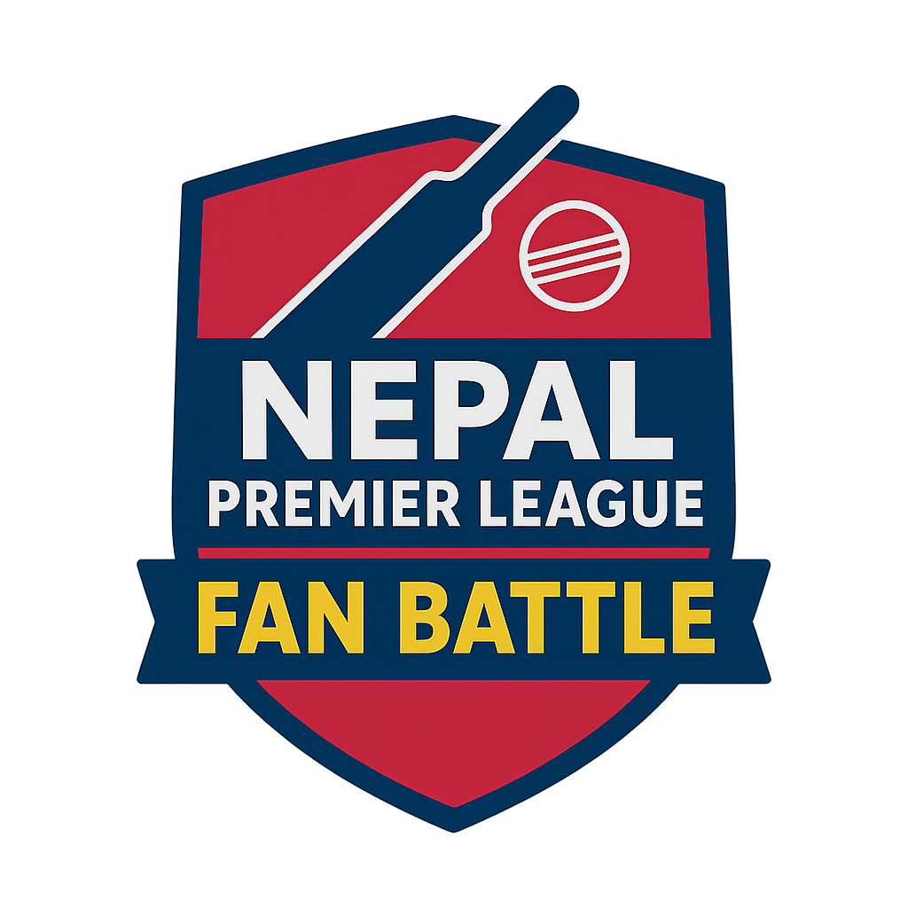

# 🏆 NPL Fan Battle - Cricket Prediction Game

A modern Progressive Web App (PWA) for predicting Nepal Premier League (NPL) matches and competing with friends.



## ✨ Features

- **🎯 Match Predictions**: Predict winners, Player of the Match, innings scores, and wickets
- **🏆 Tournament Predictions**: Pick your season team, Player of the Tournament, top run scorer, and top wicket-taker
- **📊 Live Leaderboard**: Real-time rankings and points tracking
- **📱 Progressive Web App**: Install on mobile devices for app-like experience
- **🔐 Google Authentication**: Secure sign-in with Firebase Auth
- **⚡ Real-time Updates**: Instant score updates with Firestore
- **🎨 Modern UI**: Beautiful, responsive design with Tailwind CSS

## 🚀 Tech Stack

- **Frontend**: Next.js 14 (App Router), TypeScript, Tailwind CSS
- **Backend**: Firebase (Firestore, Authentication)
- **Deployment**: Vercel
- **State Management**: React Context API
- **UI Components**: Lucide Icons, Custom Components

## 🏗️ Project Structure

```
FanBattle/
├── app/                    # Next.js app directory
│   ├── page.tsx           # Home page with match list
│   ├── dashboard/         # User dashboard
│   ├── predict/[id]/      # Match prediction page
│   ├── register/          # User registration
│   ├── leaderboard/       # Rankings page
│   ├── admin/             # Admin panel
│   └── login/             # Login page
├── components/            # Reusable components
│   ├── Navbar.tsx        # Navigation bar
│   ├── MatchCard.tsx     # Match display card
│   └── PlayerSearchSelect.tsx # Player search component
├── lib/                   # Utilities and helpers
│   ├── firebase.ts       # Firebase configuration
│   ├── firestore.ts      # Firestore queries
│   ├── auth-context.tsx  # Authentication context
│   └── prediction-rules.ts # Prediction logic
├── scripts/              # Utility scripts
│   └── seed.ts          # Database seeding
├── public/              # Static assets
│   ├── teams/          # Team logos
│   └── hero-banner.jpg # Hero image
└── players-by-team.csv  # Player CSV data (team-wise)

```

## 🛠️ Setup Instructions

### Prerequisites

- Node.js 18+ 
- npm or yarn
- Firebase account
- Vercel account (for deployment)

### 1. Clone the Repository

```bash
git clone https://github.com/YOUR_USERNAME/FanBattle.git
cd FanBattle
```

### 2. Install Dependencies

```bash
npm install
```

### 3. Configure Firebase

Create a `.env.local` file in the root directory:

```env
NEXT_PUBLIC_FIREBASE_API_KEY=your_api_key
NEXT_PUBLIC_FIREBASE_AUTH_DOMAIN=your_auth_domain
NEXT_PUBLIC_FIREBASE_PROJECT_ID=your_project_id
NEXT_PUBLIC_FIREBASE_STORAGE_BUCKET=your_storage_bucket
NEXT_PUBLIC_FIREBASE_MESSAGING_SENDER_ID=your_sender_id
NEXT_PUBLIC_FIREBASE_APP_ID=your_app_id
NEXT_PUBLIC_FIREBASE_MEASUREMENT_ID=your_measurement_id
NEXT_PUBLIC_ADMIN_EMAIL=your_admin_email
```

### 4. Firebase Setup

1. Go to [Firebase Console](https://console.firebase.google.com/)
2. Create a new project
3. Enable **Firestore Database**
4. Enable **Authentication** with Google provider
5. Update Firestore Security Rules:

```javascript
rules_version = '2';
service cloud.firestore {
  match /databases/{database}/documents {
    match /{document=**} {
      allow read, write: if true; // For development only
    }
  }
}
```

**Note**: Update security rules for production!

### 5. Seed the Database

```bash
npm run seed
```

This will populate your Firestore with:
- Tournament data
- Match schedules
- Team information

**Note**: Players should be imported separately using:
```bash
npm run import-players scripts/players-by-team.csv
```

### 6. Run Development Server

```bash
npm run dev
```

Open [http://localhost:3000](http://localhost:3000) in your browser.

## 📊 Database Structure

### Collections

- **`tournaments`**: Tournament information
- **`teams`**: Team details and logos
- **`matches`**: Match schedules and results
- **`players`**: Player information
- **`entries`**: User registrations and tournament picks
- **`predictions`**: User match predictions
- **`leaderboard`**: Real-time rankings

## 🎮 How to Play

1. **Sign In**: Use your Google account
2. **Register**: Pick your season team and tournament predictions
3. **Predict Matches**: Make predictions before each match starts
4. **Earn Points**: 
   - Winner: +3 points
   - Player of the Match: +1 point
   - First Innings Score Category: +1 point
   - First Innings Wickets: +1 point
   - Season Team Bonus: +5 points (if your team wins the tournament)
5. **Climb the Leaderboard**: Compete with friends!

## 🎨 Design System

### Colors
- **Navy Blue**: `#0A233F` - Primary background
- **Golden Yellow**: `#F6C623` - Accents and CTAs
- **Crimson Red**: `#C1121F` - Highlights and badges
- **Slate Gray**: `#E6E9EE` - Light backgrounds
- **Off-white**: `#F9FAFB` - Page background

### Typography
- **Font**: Inter (Google Fonts)
- **Headings**: Bold, tracking-tight
- **Body**: Regular, comfortable line-height

## 🚀 Deployment

### Deploy to Vercel

1. Push your code to GitHub
2. Go to [Vercel Dashboard](https://vercel.com/dashboard)
3. Click "New Project"
4. Import your GitHub repository
5. Add environment variables from `.env.local`
6. Click "Deploy"

Your app will be live at `https://your-app.vercel.app`

## 📱 PWA Features

- **Installable**: Add to home screen on mobile devices
- **Offline Ready**: Service worker caching (coming soon)
- **App-like Experience**: Full-screen mode, splash screen

## 🔧 Scripts

- `npm run dev` - Start development server
- `npm run build` - Build for production
- `npm start` - Start production server
- `npm run lint` - Run ESLint
- `npm run seed` - Seed database with initial data

## 📝 Environment Variables

| Variable | Description |
|----------|-------------|
| `NEXT_PUBLIC_FIREBASE_API_KEY` | Firebase API key |
| `NEXT_PUBLIC_FIREBASE_AUTH_DOMAIN` | Firebase auth domain |
| `NEXT_PUBLIC_FIREBASE_PROJECT_ID` | Firebase project ID |
| `NEXT_PUBLIC_FIREBASE_STORAGE_BUCKET` | Firebase storage bucket |
| `NEXT_PUBLIC_FIREBASE_MESSAGING_SENDER_ID` | Firebase messaging sender ID |
| `NEXT_PUBLIC_FIREBASE_APP_ID` | Firebase app ID |
| `NEXT_PUBLIC_FIREBASE_MEASUREMENT_ID` | Firebase measurement ID |
| `NEXT_PUBLIC_ADMIN_EMAIL` | Admin user email |

## 🤝 Contributing

Contributions are welcome! Please feel free to submit a Pull Request.

## 📄 License

This project is licensed under the MIT License.

## 🙏 Acknowledgments

- Nepal Premier League for the tournament data
- Firebase for the backend infrastructure
- Vercel for hosting
- The amazing Next.js and React communities

## 📧 Contact

For questions or support, please contact: aman.nepid@gmail.com

---

**Built with ❤️ for Nepal Premier League fans**

🏏 Good luck with your predictions!
